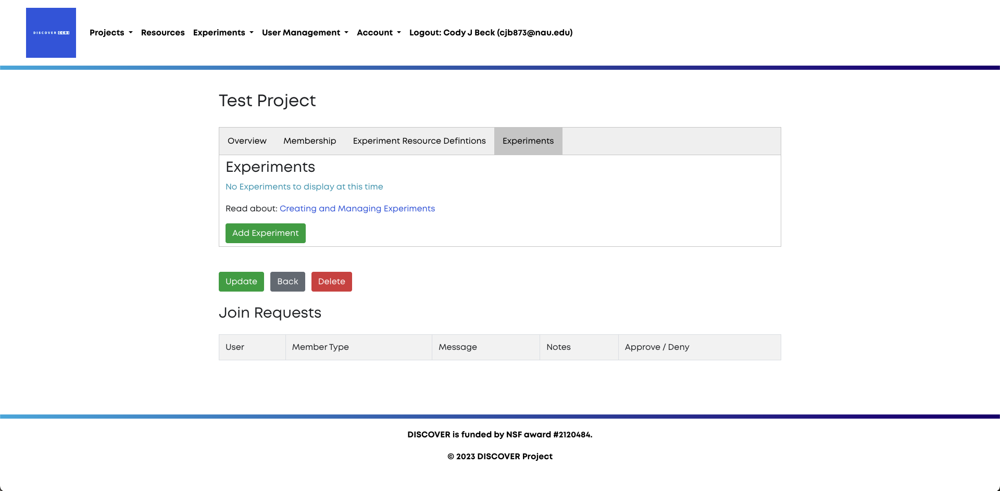

# Experiments

Experiments are where principal actions take place inside the Discover portal.
Experiments contain all of the code necessary to take some action using Discover
hardware. The primary experiment flow for Discover is shown below.

 

Users create experiments based on our GitHub templates, and submit their code using
the Discover portal. The portal notifies an administrator, who can accept or decline
the experiment. Once an experiment has been accepted and scheduled, an operator
is notified. The operator will manage the operation of the experiment on the
hardware, as well as any actions that need to be taken in the portal. All portal actions
will result in a email being sent to the experimenter. Additionally, the portal will
contact the server at the experiment site, which will build all of the code
for the experiment. The requested nodes will receive experimental code, 
in the form of a Docker container. Then, the operator can run the code, and submit 
results back to the user.  

### Experiment Creation

To create an experiment, navigate to the **Experiments** tab within the project
to which the experiment pertains. Click the **Add Experiment** button. 

Next, you will be presented with the experiment creation screen. Here, you will
name your experiment, provide the experiment description, along with the experiment
resource definition. 

The description of your experiment can include any information you wish to include,
but it *must* include a link to the templated GitHub repository containing your
experiment's code. For more information about experiment templates, click [here](experiment_templates.md).

The experiment resource definition states what devices and capabilities your experiment
will use. For more information about resource definitions, click [here](resource_definitions.md)

Click **Save Experiment** to create the experiment.  

### Experiment Initiation

As you develop your experiment, you can add anyone from within your project as
additional experimenters using the **Update Experimenters** button, change the
description using the **Change** button, and get a list of experiment resources
using the **Manifest** button. Once you are ready for your experiment to be deployed
click the **Initiate Development** button. This signals to a Discover operator
that your experiment is ready to be deployed, and will automatically notify them.  

### Final Steps

Once you have initiated development, you can still change your experiment description
and the experimenters. Once the experiment mode changes to **TESTBED** these are 
locked in. Additionally, after you have initiated development, you should update
the cloud storage link *immediately*. This link directs the operator to some cloud
storage website such as Google Drive or Dropbox. The operator will deposit the results
of your experiment in this location once it has been completed. Make sure that the operator
has the proper permissions to upload files to the cloud storage site *by using the link*.  

### Additional Information

The **Terminate** button will not delete your experiment, it will only send it back
to the **Idle** mode, which is the mode the experiment began in before you clicked
on **Initiate Development**. Experiments should be terminated when changes to your
code need to be made after you have clicked **Initiate Development**. 

You will receive emails whenever something happens with your experiment. Emails 
can be notifying you that your experiment has been deployed, that there is some
sort of issue with your experiment, or that your experiment has finished. Emails
will be sent to the address(es) associated with all experimenter(s).  
