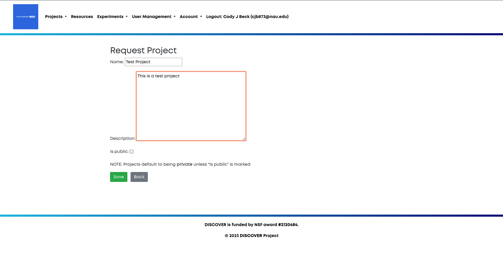
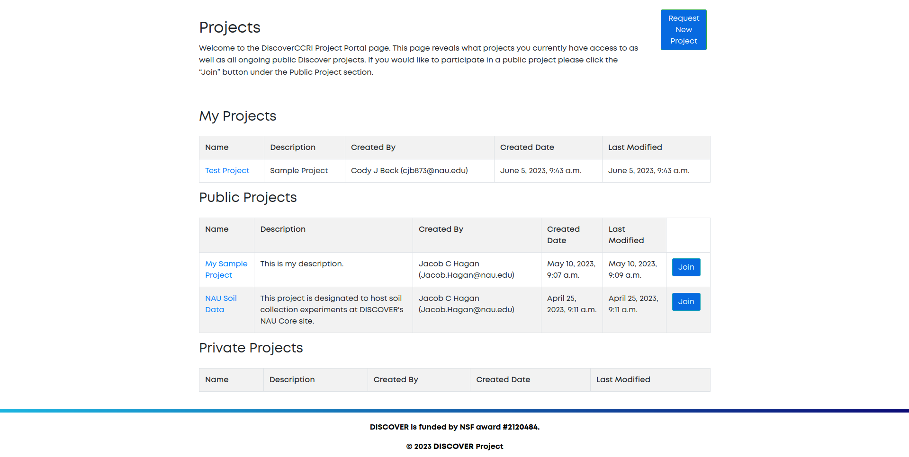
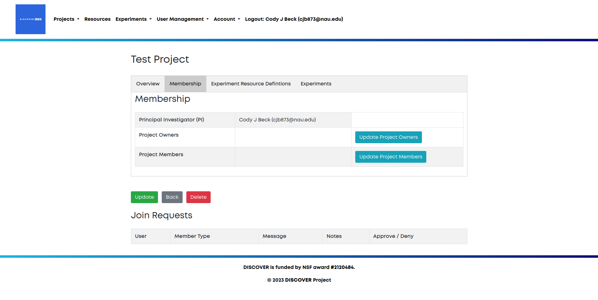
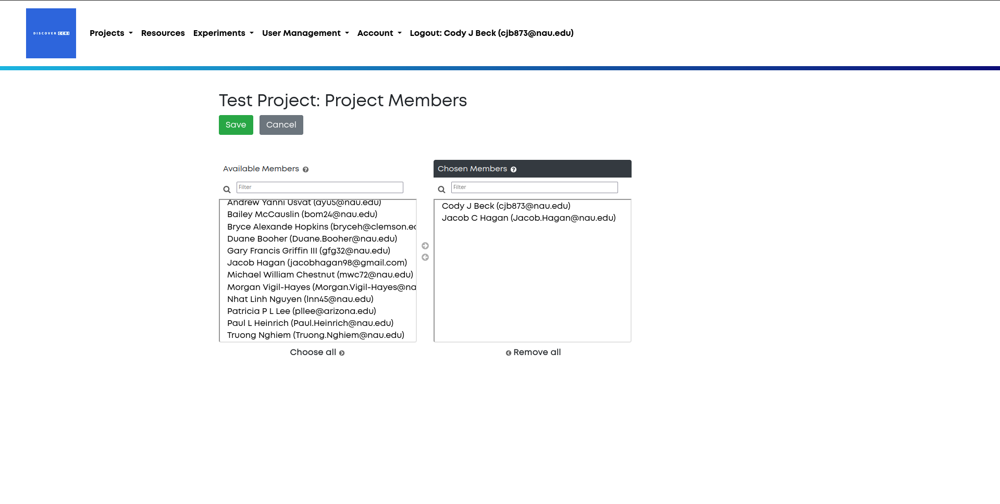

# Projects

Projects are the highest level of organization within Discover. Projects can be
home to multiple users, owners and experiments. Each project has one principal
investigator. We recommend creating only one project per entity (organization, lab, or 
research grant). Thus all experiments for the entity will be in one place, and under
the purview of a single principal investigator. 

## Project Creation and Management

*This section is for principal investigators (PIs) and project owners only.*

### Project Requests
To create a project, navigate to the **Request Project** option in the navigation bar.  

Next, fill in the fields for the project's name and description. Usually the name
will be the name of your entity, and the description will be a general description
of what your entity plans to do with the Discover platform.

Once you have filled out these fields, your last choice is to decide whether or not
your project should be private. By default, all projects are private. All aspects of
public projects can be viewed by all users of Discover.

Finally, click on the **save** button. This will save your project request and notify
the Discover team of your request. To view all of your requests you can click on the 
**Project Requests** option in the navigation bar.

### Project Setup
Once your project has been approved, navigate to **Project List** using the navigation bar.
Here you can see a list of all of your projects, along with a list of pubic projects that
you can request to join. 

Click on your new project's name to view the project homepage. This will give you
important information such any requests to join your project, user lists,
experiment resource definitions, and a list of all your project's experiments.

### Managing Users
For your project, you are able to add project owners and project users. Project users
have the ability to create and manage experiments and experiment resource definitions.
Project owners have the added capabilities of adding new users to the project.
To add new users and owners, navigate to the **Membership** tab of your project.

Click on the **Update Project Users** button to update the users, or the **Update Project Owners**
button to update the owners. 

Once you have selected which to update, you will be presented with two lists of members.
The left side lists all Discover users that can be added to your project, whereas the
right side contains all Discover users that have already been added to your project.
Double click on a user to move them to the other side, or single click and use the arrows
in the middle of the two lists to move a member. Use the **save button** to save all changes.  

### Experiments
The other two tabs, [Experiment Resource Definitions](resource_definitions.md) and 
[Experiments](experiments.md), will be covered in other sections.

